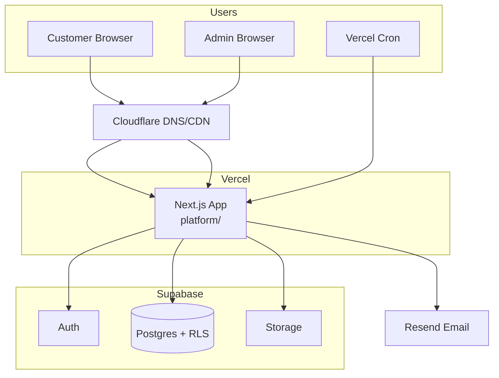
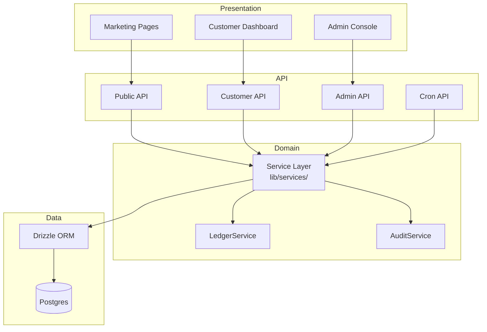
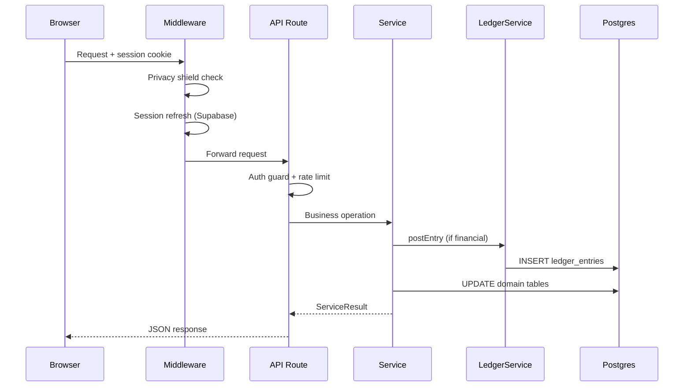
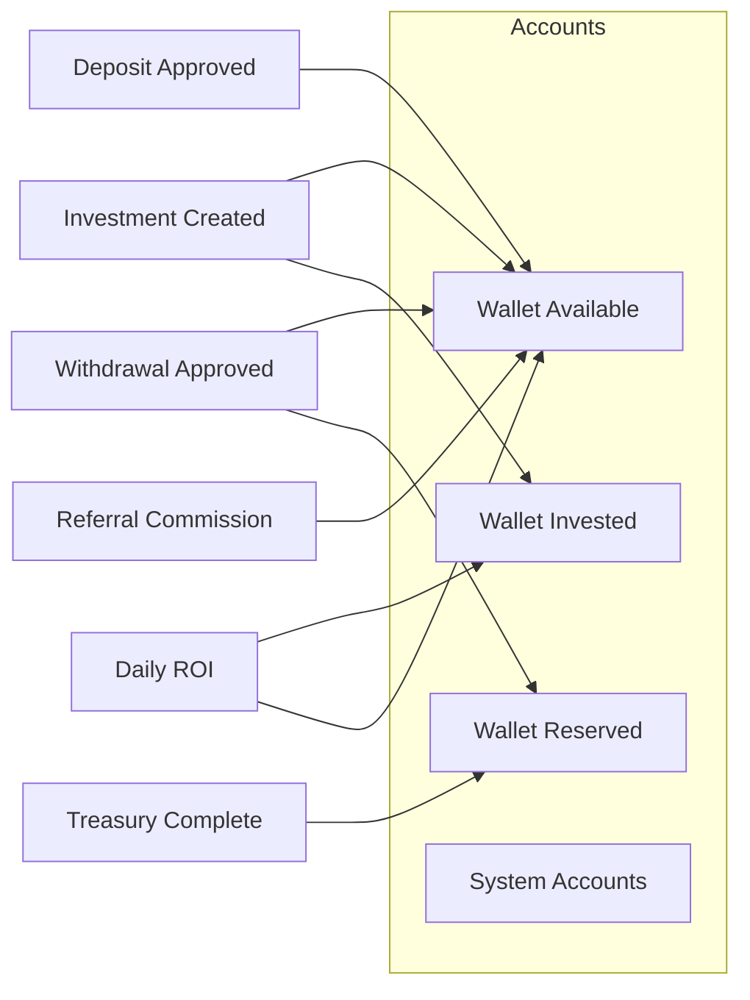
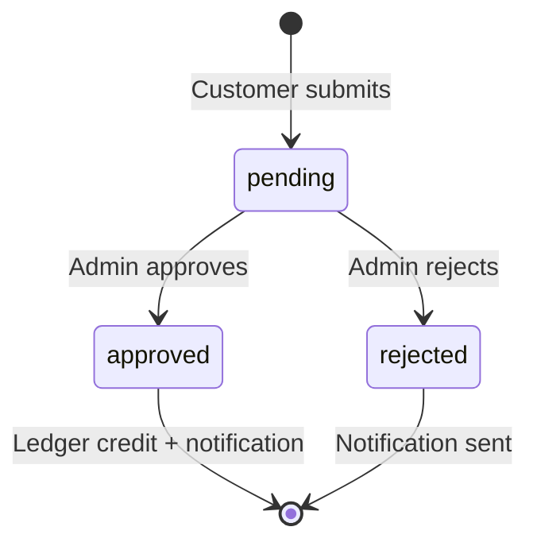
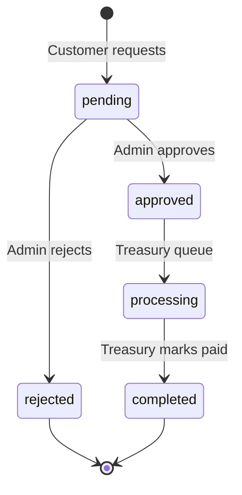
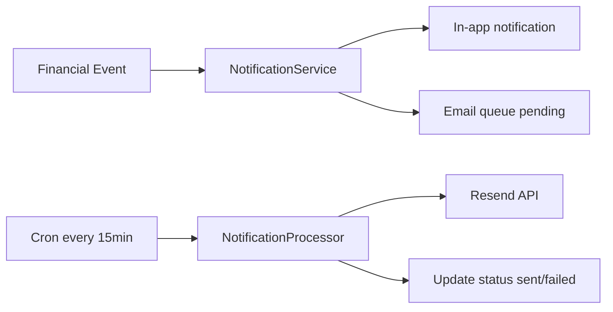
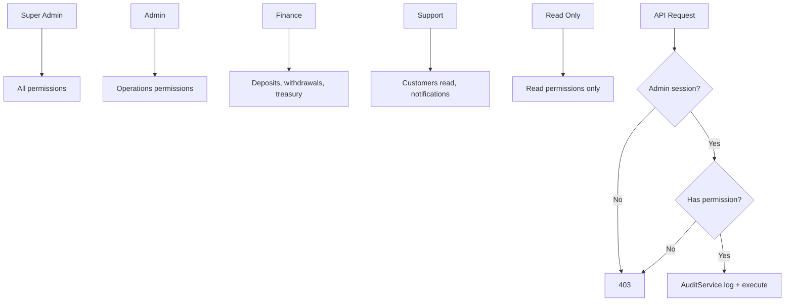
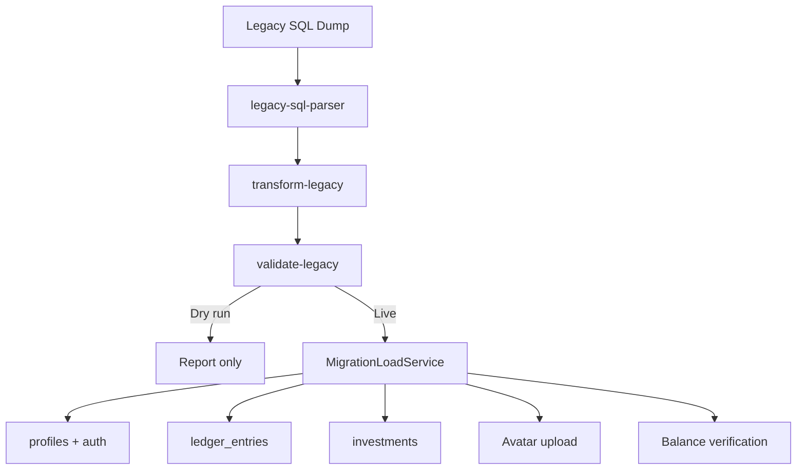

# Architecture — Unique Sky Way Platform v1.0

System architecture reference with diagrams. See `DEVELOPER_GUIDE.md` for implementation details and `DECISIONS.md` for ADRs.

---

## 1. System Context



---

## 2. Application Layers



---

## 3. Request Flow (Authenticated Customer)



---

## 4. Financial Ledger Model



**Principle:** Balances are computed from `ledger_entries`; no mutable balance columns.

---

## 5. Deposit Workflow



---

## 6. Withdrawal Workflow



---

## 7. ROI Scheduler

```mermaid
flowchart TB
    CRON[Vercel Cron 06:00 UTC] --> ROI[/api/cron/roi]
    ROI --> AUTH{CRON_SECRET valid?}
    AUTH -->|No| REJECT[401]
    AUTH -->|Yes| PROC[RoiSchedulerService]
    PROC --> ACTIVE[Get active investments]
    ACTIVE --> LOOP[For each investment]
    LOOP --> IDEM{Already processed today?}
    IDEM -->|Yes| SKIP[Skip]
    IDEM -->|No| POST[LedgerService.postEntry]
    POST --> NOTIFY[NotificationService]
    LOOP --> LOG[Log run to roi_processing_runs]
```

---

## 8. Notification Pipeline



---

## 9. Admin RBAC



Roles defined in `admin_users.role` enum. Permissions in `permissions` + `role_permissions` tables.

---

## 10. Legacy Migration Pipeline



---

## 11. Security Boundaries

| Boundary | Mechanism |
|----------|-----------|
| Customer data isolation | Postgres RLS (`auth.uid()` → `current_profile_id()`) |
| Admin access | `is_admin()` RLS + API permission checks |
| Pre-launch privacy | `SITE_ACCESS_KEY` middleware gate |
| Crawler blocking | User-agent filter in middleware |
| Cron protection | `CRON_SECRET` bearer token |
| File uploads | Supabase Storage RLS + MIME validation |
| Secrets | Server-only env vars; never in client bundle |

---

## 12. Deployment Topology

```
                    ┌─────────────┐
                    │ Cloudflare  │
                    │ DNS + CDN   │
                    └──────┬──────┘
                           │
                    ┌──────▼──────┐
                    │   Vercel    │
                    │  (platform) │
                    │  + Cron     │
                    └──────┬──────┘
                           │
              ┌────────────┼────────────┐
              │            │            │
       ┌──────▼──────┐ ┌───▼───┐ ┌─────▼─────┐
       │  Supabase   │ │Resend │ │  GitHub   │
       │ Auth+DB+    │ │ Email │ │  Source   │
       │ Storage     │ │       │ │  (future) │
       └─────────────┘ └───────┘ └───────────┘
```

---

## 13. Database Schema Overview

| Domain | Tables |
|--------|--------|
| Identity | `profiles`, `admin_users`, `user_sessions`, `login_history` |
| Ledger | `ledger_accounts`, `ledger_entries` |
| Financial | `deposit_requests`, `withdrawal_requests`, `investments`, `investment_plans` |
| Referrals | `referral_relationships`, `referral_commissions` |
| Operations | `audit_logs`, `notifications`, `notification_events`, `feature_flags`, `system_settings` |
| Migration | `migration_runs`, `migration_checkpoints`, `legacy_transactions_archive` |
| RBAC | `permissions`, `role_permissions` |

Full schema: `src/db/schema/` + `supabase/migrations/0000_initial_schema.sql`

---

*Architecture v1.0 — July 2026*
